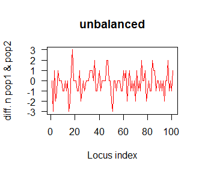
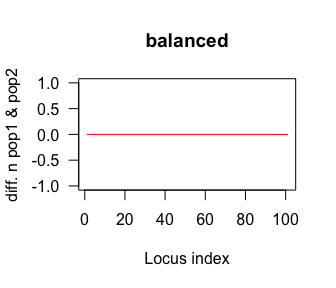

<!-- README.md is generated from README.Rmd. Please edit that file -->
genrich
=======

The R package genrich includes functions for comparing genetic diversity between populations, a task often required in the field of conservation genomics. genrich works in conjunction with R package hierfstat to calculate gene diversity (Hs) and allelic richness (AR) of population samples on 'a level playing field', where the sample size of each locus is balanced between populations. Permutation procedures facilitate tests for assessing whether diversity is higher in one sample relative to another, and estimation of confidence intervals via bootstrapping. Rarefaction can be implemented in a (traditional) locus-wise manner, or in a population-wise manner using function "bal\_loci". Other functions include rarefaction of population-specific FST estimates; analysis of molecular covariance (AMCOVA; still to come). genrich expects data in hierfstat format (see: <https://cran.r-project.org/web/packages/hierfstat/index.html>).

Installation
------------

You can install genrich from github with:

``` r
# install.packages("devtools")
devtools::install_github("Daniel-J-Schmidt/genrich")
```

Example
-------

This example shows how a dataset containing uneven sample size per locus (due to random missing genotypes) is balanced. The data consists of 20 individuals scored for 100 co-dominant loci and divided into two samples (n = 10). Missing data is randomly scattered throughout, so that many loci have uneven sample size between the two populations (left fig.). Function bal\_loci randomly equalizes the sample size independently for each locus (right fig.).

``` r
genrich::plot_bal_loci(genrich::dat.sim, col = "red", main = "unbalanced")
genrich::plot_bal_loci(genrich::bal_loci(genrich::dat.sim), col = "red", main = "balanced")
```


